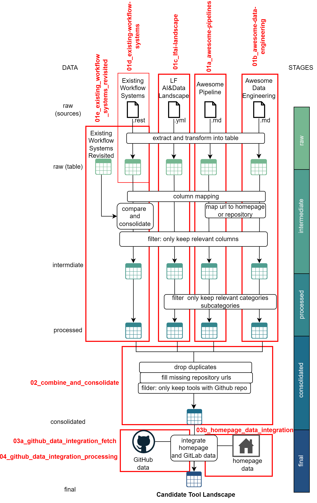
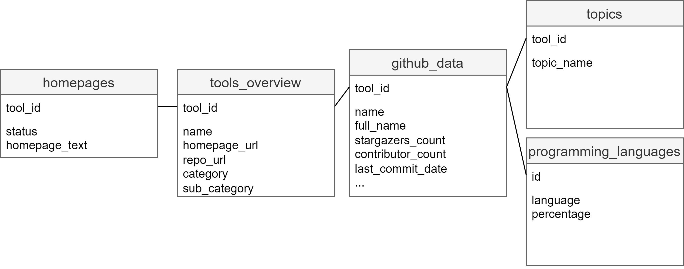

# Reproduciblity in Data Preproessing: An Evaluation of Open-Source Tools

This project investigated (October 2022- September 2023) how open-source tools facilitate reproducible dataprocessing, focusing on supporting the development of high-quality data products.
A comprehensive literature review was conducted to identify sixteen crucial reproducibility features for ensuring reproducible data preprocessing. To evaluate the support levels of these features, enabling criteria
were defined, providing a foundation for assessing open-source tools in
terms of reproducibility.


Addressing the challenge of selecting appropriate tools for implementing
reproducible data pipelines, a data candidate landscape was constructed using 
community-maintained lists of tools in the data and AI domain. Leveraging 
the knowledge of the community, this approach facilitated the identification 
of 359 open-source tools with valid GitHub repositories. A curated
collection of tools was obtained by consolidating information from the tools’
homepages and GitHub statistics, simplifying the selection process for future work.

An evaluation framework was applied based on the identified reproducibil-
ity features and criteria to evaluate the selected tools further. Six open-source
tools were assessed based on requirements related to code sharing, environment management, data quality, and workflows. Although none of the evaluated tools met all criteria, most supported integrating other open-source solutions. Therefore, combining multiple tools could enhance the overall reproducibility support in data processing workflows.


## Candidate Tool Landscape

All relevant code and data used to create the candidate tool landscape for reproducible data preprocessing is part of this repository. 

The design idea of the candidate tool landscape was to have a consolidated overview of tools relevant for (reproducible) data preprocessing, extracted from community-maintained tool lists. 

---


The steps and stages of the data processing pipeline are implemented in the Jupyter notebooks, as depicted in the figure below.
The steps of the data preprocessing pipeline for the different data sources, the GitHub project data integration, and the homepage integration can be followed in the respective Jupyter notebooks.

<figure>

## Data Model

The candidate tool landscape data product comprises 5 tables created in the data processing pipeline which are saved in the `data/final` folder.

<figure>


## Repository Structure

* `slide-deck.pdf`: Provides an overview of this projects in more details
* `code`
    * `01a_awesome-pipelines.ipynb`: Jupyter notebook to integrate the [awesome pipeline](https://github.com/pditommaso/awesome-pipeline) data source. Covers stages **raw**,**intermediate**, and  **processed**.
    * `01b_awesome-data-engineering.ipynb`: Jupyter notebook to integrate the [awesome data engineering](https://github.com/igorbarinov/awesome-data-engineering) data source. Covers stages **raw**,**intermediate**, and  **processed**.
    * `01c_lfai-landscape.ipynb`: Jupyter notebook to integrate the [LF AI and data landscape](https://landscape.lfai.foundation) data source. Covers stages **raw**,**intermediate**, and  **processed**.
    * `01d_existing-workflow-systems.ipynb`: Jupyter notebook to integrate the [existing workflow system](https://github.com/common-workflow-language/common-workflow-language/wiki/Existing-Workflow-systems) data source. Covers stages **raw** and **intermediate**.
    * `01e_existing_workflow_systems_revisited.ipynb`: Jupyter notebook to integrate the **existing workflow system revisited** data source. Covers stages **raw**,**intermediate**, and  **processed**.
    * `02_combine_and_consolidate.ipynb`: Covers the **consolidated** stage of the data processing pipelines and combines the data generated in the **processed** stage from notebooks `01a`, `01b`, `01c` and `01e`.
    * `03a_github_data_integration_fetch.ipynb`: Fetches the relevant GitHub project data for tools in the `tools` data product generated as part of `02_combine_and_consolidate.ipynb` in the **consolidated** stage.
    * `03b_homepage_data_integration.ipynb`: Creates the `homepages` table as part of the ** final** stage. Fetches the homepage data for tools in the `tools` data product generated as part of `02_combine_and_consolidate.ipynb` in the **consolidated** stage.
    * `04_github_data_integration_processing.ipynb`: Creates the tables `github`, `github_topics`, and `github_languages` as part of the **final stage**. Processed the fetched GitHub data of the notebook `03a_github_data_integration_fetch.ipynb` and created the GitHub-related tables for the candidate tool landscape.
* `data`: The `data` folder contains all results of the data processing pipeline. For each pipeline stage/step the respective data is saved in the respective subfolder (`raw`,`intermediate`,`processed`,`consolidated`,`final`). 
* `snippets.py`: Collection of helper functions to fetch GitHub project information. Used in some of the Jupyter notebooks
* `conda_environment.yml`: [Conda environment file](https://docs.conda.io/projects/conda/en/latest/user-guide/tasks/manage-environments.html#creating-an-environment-from-an-environment-yml-file) - Python packages used to run the data processing pipeline. 


## How to run the data processing pipeline to create the candidate tool landscape


This project uses Python 3.11 and uses [conda](https://docs.conda.io) to manage the Python dependencies.

1. create the conda environment from the `conda_environment.yml` file ( also see conda documentation [here](https://docs.conda.io/projects/conda/en/latest/user-guide/tasks/manage-environments.html#creating-an-environment-from-an-environment-yml-file)). This will create the conda environment _candidate-tool-landscape_.
```
conda env create -f conda_environment.yml
```
2. Create a specific kernel for the conda environment - where the kernel name is _candidate-tool-landscape_ and can then be used for the Jupyter notebooks:
```
conda activate candidate-tool-landscape
ipython kernel install --user --name=candidate-tool-landscape
```
3. Run the Jupyter notebooks using the kernel _candidate-tool-landscape_. The notebooks are numbered to identify the execution sequence (first run all `01` notebooks and then progress to the `02` notebooks and so on). Notebooks with the same number (e.g. `01`) can be executed in parallel.